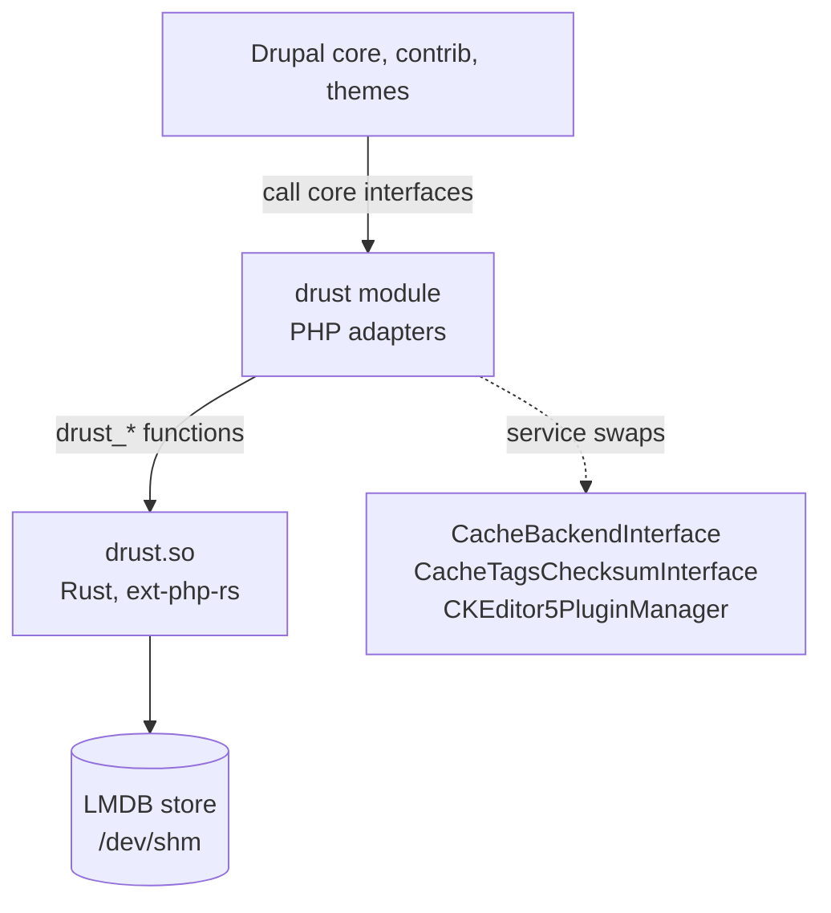

# drust

**Rust underneath Drupal: faster core services, with no changes to contrib.**

drust replaces some of Drupal's core services with faster implementations,
most of them in Rust, compiled into a PHP extension. Each one swaps in behind
an interface Drupal already has, so core, contrib modules and themes keep
working unchanged. It's an experiment, and "drust" is a working name.

On a stock Drupal 11.4 site, drust made every tested page 13–38% faster:

| Page | Stock req/s | With drust | Change |
|---|---|---|---|
| Node with comment form, logged in | 150 | 206 | +37.6% |
| Taxonomy term, logged in | 345 | 428 | +24.1% |
| Front page, logged in | 393 | 459 | +16.6% |
| Front page, anonymous | 1,906 | 2,346 | +23.1% |

Two identical sites on one host (PHP 8.5 FPM, MariaDB on localhost, APCu),
median of 5 rounds with `ab`. Full numbers, method and caveats are in
[FINDINGS.md](FINDINGS.md).

## What it replaces

| Component | Stock Drupal | drust |
|---|---|---|
| Cache storage (all bins) | Database tables, APCu for 4 bins | Rust: an LMDB store in `/dev/shm`, shared by all PHP processes on the machine |
| Cache-tag checksums | The `cachetags` database table | Rust: counters in the same store, offset by a random epoch so a wiped store can't make stale data look valid |
| CKEditor 5 enabled-plugin list | Recomputed twice per request (about 5ms) | PHP: cached, keyed by the editor's and text format's contents |

Each is switched on separately in `settings.php`.

## How it works



The Drupal module implements core's interfaces and hands storage to Rust.
PHP keeps what needs the PHP runtime: serializing values, the request time,
and core's own transaction handling for tag invalidation. Rust owns storage,
expiry, invalidation and the counters.

Every swap is checked against **Drupal core's own test suites**, run
unmodified against the drust implementation: core's cache-backend
conformance suite and four CKEditor 5 kernel test classes, 195 tests in all.

## Getting started

See **[INSTALL.md](INSTALL.md)** to add drust to an existing Drupal 11 site:
build the extension for your PHP, install the module, load the extension for
your site's PHP processes, and switch features on.

Requirements: Drupal 11, PHP 8.3+ (NTS) on Linux, a single web server.

## Repository layout

| Path | What |
|---|---|
| `ext/` | The Rust PHP extension (`src/store.rs`, `src/shared.rs`, `src/lib.rs`) |
| `drupal/web/modules/custom/drust/` | The Drupal module and its tests |
| `drupal/` | A local Drupal 11 test site (SQLite) |
| `docker/` | Dev image: PHP 8.5 + Rust + Composer |
| `bin/` | `dev`, `build-ext`, `build-ext-linux`, `bench`, `deploy-drupal02` |
| `bench/` | Benchmark scripts, content generator, raw results; `profile/` has the Excimer profiling tools |
| `deploy/server/` | PHP-FPM pools, Drush wrapper and settings used on the benchmark host |
| [FINDINGS.md](FINDINGS.md) | Every bug, fix, gotcha and design lesson so far |

## Development

Everything runs in Docker; nothing needs installing on your machine.

```sh
docker build -t drust-dev docker     # PHP 8.5 + Rust dev image
bin/build-ext                        # build ext/drust.so for the dev image
bin/dev vendor/bin/drush status      # run anything against the local site

# The test suite (core's suites against drust, plus drust's own):
bin/dev sh -c 'SIMPLETEST_DB=sqlite://localhost//tmp/test.sqlite \
  SIMPLETEST_BASE_URL=http://localhost vendor/bin/phpunit \
  -c web/core/phpunit.xml.dist web/modules/custom/drust/tests'
```

The local site uses the `standard` profile plus the `standard`,
`article_tags`, `article_comment` and `page_content_type` recipes (in Drupal
11.4 the profile no longer creates content types). `bench/generate.php`
creates 100 tagged articles with 300 comments. Admin login: `admin` / `admin`.

Locally, the `DRUST_CACHE` environment variable picks the cache mode:

- `1`: every bin in Rust, private to one PHP process. Fastest, but other
  processes (Drush, other workers) never see its writes.
- `chained`: Rust in front of the database via core's `ChainedFastBackend`.
- `shared`: the shared LMDB store, consistent across processes.
- unset: core's database backend.

`bin/bench` compares them. `/admin/reports/drust` shows the stores' contents.

For a Linux server, `PHP_VERSION=8.5 PLATFORM=linux/amd64 bin/build-ext-linux`
builds `ext/dist/drust-php8.5-x86_64.so`.

### The benchmark setup

`drupal01.example.com` is stock Drupal, `drupal02.example.com` runs drust;
they're otherwise identical. `bin/deploy-drupal02` deploys, and
`bench/remote-bench.sh` (on the server) benchmarks both alternately, running
cron to completion first. `bench/summarize.py` prints medians and each site's
spread across rounds; distrust runs with a large spread. `bench/profile/`
holds the Excimer profiling hook and the scripts that summarize its output.

## Limits

- One web server only: the store is shared per machine, like APCu.
- Measured on one small shared host, 3 pages, concurrency 4.
- When the store reaches 70% of its size it's emptied completely (no LRU yet).
- Profiling shows most remaining request time is Drupal's PHP machinery spread
  thinly, with little left that Rust could take over through an extension.
  Details in [FINDINGS.md](FINDINGS.md).
